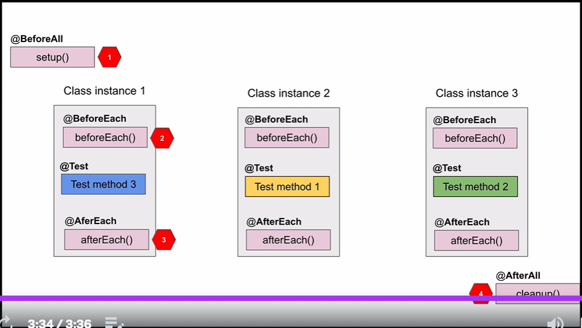

# Testing Java with JUnit 5 & Mockito 

These are personal notes on the Udemy course "Testing Java with JUnit 5 & Mockito" by Sergey Kargopolov.

## Section 1: Introduction

This part is more theoretical.
Here the course first explains what a unit test is in general.
It is mentioned that unit tests are very fast because mocks/fakes/spies are mostly used when dependencies exist.
The following reasons are given why we should write unit tests:
* Make sure the code works
* Code works with valid and invalid input parameters
* Code works now and in the future
* Other code still works even after you made changes (Regression Testing)

It also explains what *Testing Code in Isolation* means and why it is important for unit testing.
In this context, the importance of *Dependency Injection* is discussed.

The Testing Pyramid is discussed, consisting of:
1) Unit tests (bottom, runs before any other tests, testing isolated small pieces of code with fake/mock dependencies)
2) Integration tests (use real dependencies/objects, Application code is tested without mocking db or http connections)
3) End-to-End Testing / UI Testing (top, automated tests, Testing functionality from beginning to end e. g. with selenium)


But what is JUnit 5?  

A testing framework for unit testing in Java.

JUnit5 = JUnit Platform + JUnit Jupiter + JUnit Vintage
* JUnit Platform: Serves as a foundation for launching testing frameworks on the JVM.
* JUnit Jupiter: A combination of new programming model + extension model for writing tests and extensions in JUnit5 (annotations/assertions, extension api allows us to create our own version of test api)
* JUnit Vintage: Test engine for older versions of JUnit.

## Section 2: Add JUnit5 to Maven project

The course explains what to do if you want to use JUnit5 in a project with Maven.
For this purpose, a Maven project *CalculatorMavenProject* is created.
JUnit Jupiter (aggregator) is required in the pom.xml:

```
<dependency>
    <groupId>org.junit.jupiter</groupId>
    <artifactId>junit-jupiter</artifactId>
    <version>5.9.1</version>
    <scope>test</scope>
</dependency>
```

In order to be able to run the unit tests in the Maven build lifecycle, we need to add the Surefire plugin:
```
<build>
    <plugins>
        <plugin>
            <groupId>org.apache.maven.plugins</groupId>
            <artifactId>maven-surefire-plugin</artifactId>
            <version>3.0.0-M7</version>
        </plugin>
    </plugins>
</build>
```

## Section 5: Basics of JUnit 5

You can use messages in an assertion, which are called when the test fails. 
You can also do this lazy by using a lambda expression:
```
assertEquals( expectedResult, result,
            () -> minuend + "-" + subtrahend + " did not produce " + expectedResult
        );
```

Good about this section is that the structure of a unit test is explained. 
The scheme arrange/act/assert is used here. However, I prefer to use given/when/then
like Martin Fowler.

### JUnit Test Lifecycle

By default, an instance of the test class is created for each test method when running JUnit tests.
The order in which a test is carried out is "random".
There are a few lifecycle annotations:
* @BeforeAll (Annotated method is called before any test method is called. For example to create a DB.)
* @AfterAll (Clean Up Method. E. g. to delete DB)
* @BeforeEach (Executed before each test method)
* @AfterEach (Clean Up Method)



If you want to test for exceptions, you can use assertThrows:

```
ArithmeticException actualException = assertThrows(ArithmeticException.class, () ->
        {
            // When
            calculator.integerDivision(dividend, divsior);
        }, "Division by zero should throw an ArithmeticException");

        // Then
        assertEquals(expectedExceptionMessage, actualException.getMessage(),
                "Unexpected exception message");
```

## Section 6: Advanced JUnit 5

### Parameterized Tests
Parameterised tests are tests that accept input parameters. 
Thus, one and the same test can be tested for different values.
To obtain a parameterised test, use the annotation
*@ParameterizedTest* instead of *@Test*.

There are several ways to get the input parameters. One is to write a separate method that returns a stream<Arguments>.
If the name of the test method is identical to the method that returns the parameters, there is nothing else to do.  

Otherwise you have to use the annotation *@MethodSource("INPUT_METHOD_NAME")*.  
Example:
```
    @DisplayName( "Test integer subtraction [minuend, subtrahend, expectedResult]" )
    @ParameterizedTest
    //Only needed because the input-method name is not integerSubtraction
    @MethodSource("integerSubtractionParameters")
    void integerSubtraction(int minuend, int subtrahend, int expectedResult)
    {
        int result = calculator.integerSubtraction( minuend, subtrahend );

        assertEquals( expectedResult, result,
            () -> minuend + "-" + subtrahend + " did not produce " + expectedResult
        );
    }

    private static Stream<Arguments> integerSubtraction() {
        return Stream.of(
                Arguments.of(33, 1, 32),
                Arguments.of(54, 1, 53),
                Arguments.of(24, 1, 23)
        );
    }
```

Instead of another method, you can also use the annotation @CsvSource as follows:
```
    @DisplayName( "Test integer subtraction [minuend, subtrahend, expectedResult]" )
    @ParameterizedTest
    @CsvSource( {
            "33, 1, 32",
            "24, 1, 23",
            "54, 1, 53",
    } )
    void integerSubtraction(int minuend, int subtrahend, int expectedResult)
    {
        int result = calculator.integerSubtraction( minuend, subtrahend );

        assertEquals( expectedResult, result,
            () -> minuend + "-" + subtrahend + " did not produce " + expectedResult
        );
    }
```

Or the *@CsvFileSource(resources = "/integerSubtraction.csv")* annotation if you
want to use a csv file (here integerSubtraction.csv) with test values.

### Method Order

To run methods (to be sure) in random order use
the *@TestMethodOrder( MethodOrderer.Random.class )*
annotation at class level:

```
@TestMethodOrder( MethodOrderer.Random.class )
public class MethodOrderedRandomlyTest
{
...
}
```

To run methods by name use *@TestMethodOrder( MethodOrderer.MethodName.class )* instead.

If you want to run methods by order index
use *@TestMethodOrder( MethodOrderer.OrderAnnotation.class )*
at class level and *@Order(INDEX)* at method level.
Example:
```
@TestMethodOrder( MethodOrderer.OrderAnnotation.class )
public class MethodOrderedByOrderIndexTest {

    @Order( 1 )
    @Test
    void testD()
    {
        System.out.println( "Running Test D" );
        stringBuilder.append( "1" );
    }
    
    @Order( 2 )
    @Test
    void testA()
    {
        System.out.println( "Running Test A" );
        stringBuilder.append( "2" );
    }
}
```

